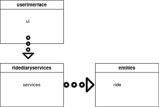
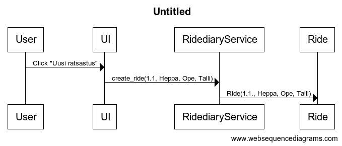
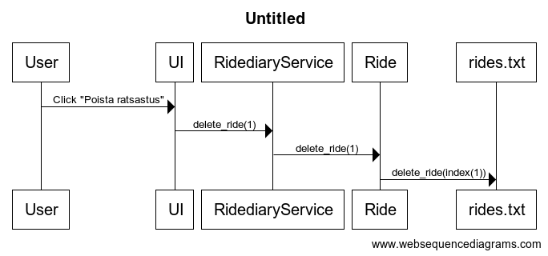

# Arkkitehtuurikuvaus

## Rakenne

Koodin pakkausrakenne on seuraava:

Pakkaus ui pitää sisällään käyttöliittymän koodin, services sovelluslogiikasta vastaavan koodin ja entities olioiden luokkien koodin.

## Sovelluslogiikka
### Päätoiminnallisuudet

Sekvenssikaavio merkinnän luomisesta:

Sekvenssikaavio merkinnän poistamisesta:

## Käyttöliittymä

Käyttöliittymässä on tällä hetkellä vain yksi näkymä, joka on toteutettu omana luokkanaan. Ui-luokka vastaa käyttöliittymän näkymän näyttämisesta. Tällä hetkellä sovelluksen näkymä ei päivity ilman sovelluksen sulkemista.

## Tietojen tallennus

Tällä hetkellä tietojen tallentamisesta vastaa tiedosto rides.txt
