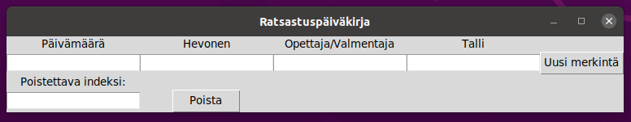

# Käyttöohje

Lataa projektin viimeisin [release](https://github.com/loeppoe/ot-harjoitustyo-ridediary/releases/tag/viikko) lähdekoodi _Assets_-osiosta kohdasta _Source code_.

## Ohjelman käynnistäminen

1. Asenna riippuvuudet komennolla:

```bash
poetry install
```

2. Käynnistä ohjelma komennolla:

```
poetry run invoke start
```

## Ride-merkintöjen luominen ja poistaminen

Ohjelma avautuu näkymään:



Näkymässä on mahdollista tallentaa uusi ride-merkintä painamalla näppäintä "uusi merkintä".

Näkymässä on mahdollista poistaa merkintä indeksistä syöttämällä merkinnän indeksi ja painamalla "poista".
