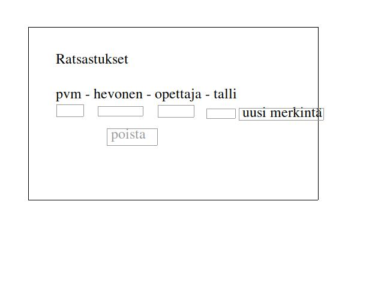

# Vaatimusmäärittely

## Tarkoitus
Sovelluksella on tarkoitus seurata ja pitää kirjaa käyttäjän ratsastuksista. Sovellusta on tarkoitus käyttää rekisteröimällä käyttäjätunnuksen, joilla kaikilla on yksilöllinen ratsastuspäiväkirja.

## Käyttäjät
Aluksi sovelluksessa on vain yksi käyttäjärooli, _peruskäyttäjä_. Myöhemmin on mahdollista lisätä erilaisia käyttäjärooleja, esimerkiksi _pääkäyttäjä_, joille olisi mahdollista antaa lisää käyttöoikeuksia. Myös käyttäjän yksilöiminen olisi mahdollista lisätä.

## Käyttöliittymäluonnos

## Perusversion toiminnalisuus
  ### Ratsastuspäiväkirja (näkymä tehty)
  - käyttäjä näkee omat ratsastuksensa (tehty)
  - käyttäjä voi lisätä ratsastuksen (tehty)
    - milloin
    - millä hevosella
    - opettaja/valmentaja/itsenäinen-harjoitus
    - mahdollisesti talli/paikka
  - käyttäjä voi poistaa ratsastuksen (tehty)
  - käyttäjä voi tallentaa tietoa (tehty)
  
## Jatkokehitysideoita
- käyttäjä voi luoda yksilöllisen käyttäjätunnuksen
- käyttäjä voi kirjautua ulos
- ratsastuksien tarkastelu lajin (este/koulu/maasto) perusteella
- kisatulosten mahdollinen kirjaaminen
- ratsastusmerkintöjen editointi
- mahdollisuus lisätä hevosen tiedot/yksilöidä hevoset
  - mahdollinen käyttäjärooli: _hevosenomistaja_
  - mahdollisesti näkisi omistamiensa hevosten kaikki ratsastajat/ratsastukset
- salansana käyttäjille
- käyttäjätunnuksen poisto
